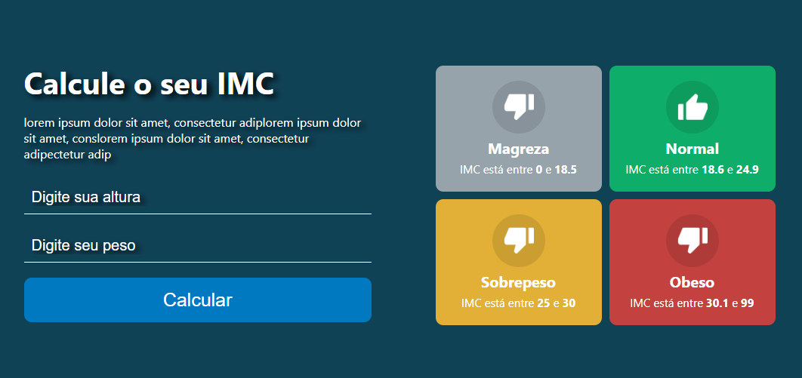
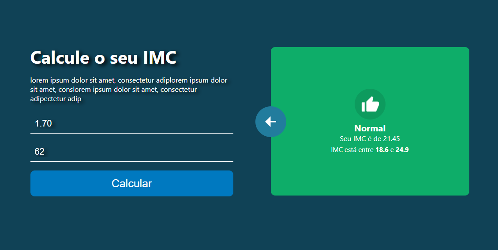

# Calcular IMC - ReactJs

Meu primeiro projeto em ReactJs, feito no curso da B7Web. Algumas partes feitas por mim e outras tive que acompanhar na aula sobre como executar alguns códigos. 

Estou com problemas na hospedagem do GitHub Pages, caso alguém possa ajudar ficarei agradecido.

#

 
